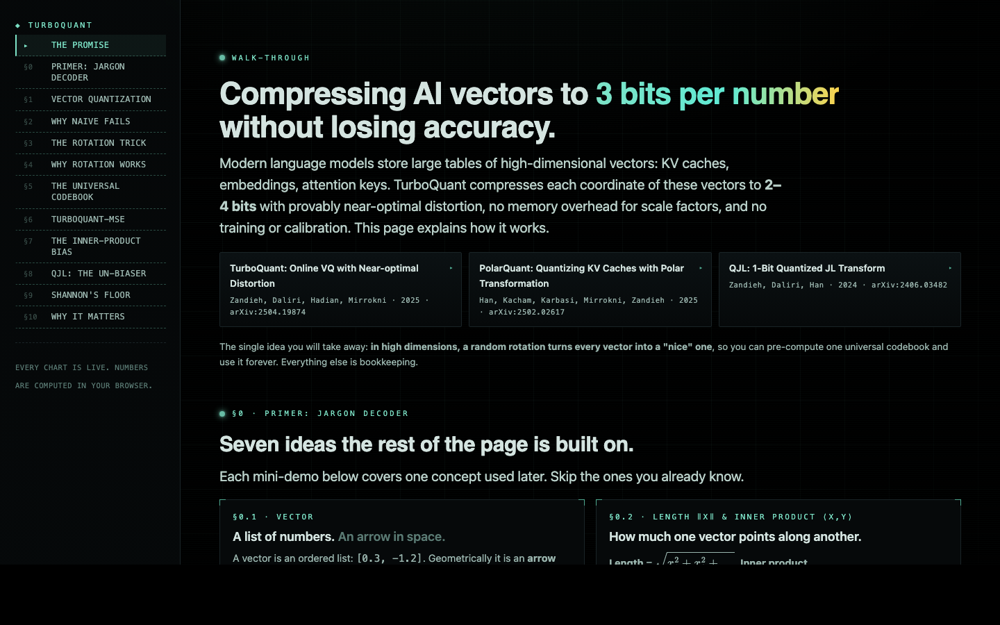

# TurboQuant, a first-principles walk-through

An interactive, single-file explainer for Google Research's [TurboQuant](https://arxiv.org/abs/2504.19874) algorithm: the rotation trick that compresses AI vectors to 3.5 bits per channel without measurable downstream quality loss, with provable distortion within a constant factor of Shannon's lower bound.

**[View the live demo →](https://arkaung.github.io/interactive-turboquant/)**

Best viewed on a desktop browser — the interactive demos rely on drag, hover, and a wide viewport.

Open `index.html` in a browser. No build step.
